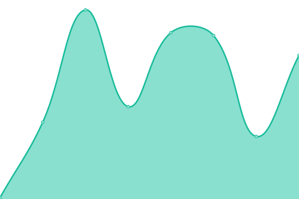
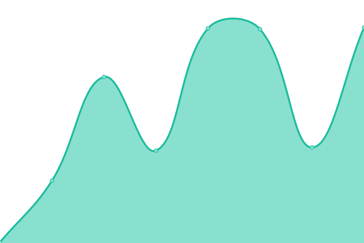
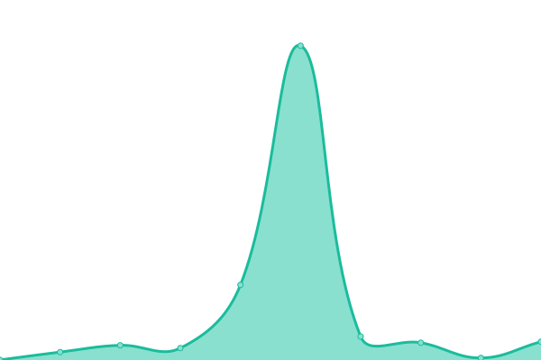
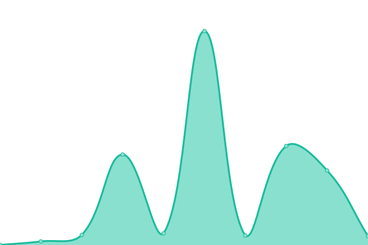
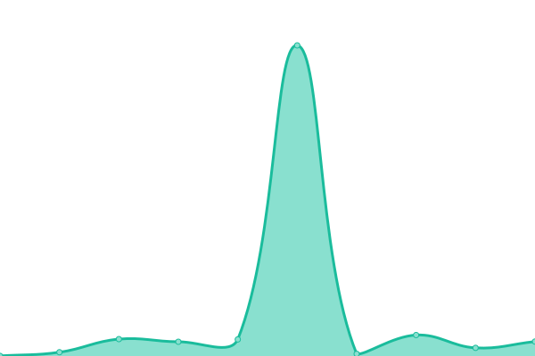
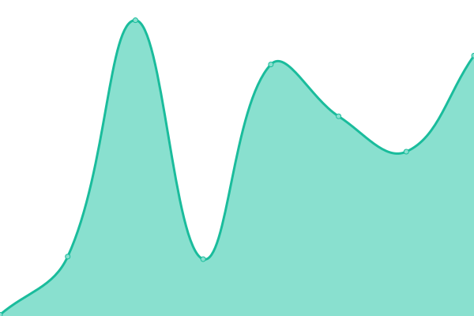
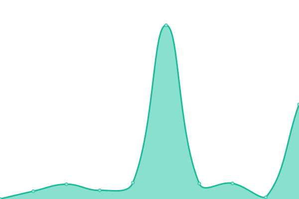
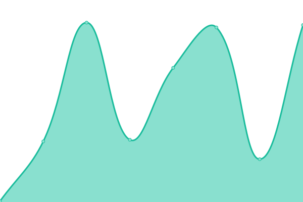

# [📈 Live Status](https://upptime): <!--live status--> **🟩 All systems operational**

This repository contains the open-source uptime monitor and status page for [Upptime](https://upptime.js.org), powered by [Upptime](https://github.com/upptime/upptime).

With [Upptime](https://upptime.js.org), you can get your own unlimited and free uptime monitor and status page, powered entirely by a GitHub repository. We use [Issues](https://github.com/upptime/upptime/issues) as incident reports, [Actions](https://github.com/s-codes14/upptime/actions) as uptime monitors, and [Pages](https://upptime) for the status page.

<!--start: status pages-->
<!-- This summary is generated by Upptime (https://github.com/upptime/upptime) -->
<!-- Do not edit this manually, your changes will be overwritten -->
<!-- prettier-ignore -->
| URL | Status | History | Response Time | Uptime |
| --- | ------ | ------- | ------------- | ------ |
|  [portfolio](https://s-codes14.github.io) | 🟩 Up | [portfolio.yml](https://github.com/S-codes14/upptime/commits/HEAD/history/portfolio.yml) | 

 78ms
     
 | 

<a href="https://s-codes14.github.io/upptime/history/portfolio">100.00%</a>
    

|  [smaller sites](https://smaller-sites.netlify.app) | 🟩 Up | [smaller-sites.yml](https://github.com/S-codes14/upptime/commits/HEAD/history/smaller-sites.yml) | 

 356ms
     
 | 

<a href="https://s-codes14.github.io/upptime/history/smaller-sites">100.00%</a>
    

|  [30sekify](https://30sekify.netlify.app) | 🟩 Up | [30sekify.yml](https://github.com/S-codes14/upptime/commits/HEAD/history/30sekify.yml) | 

 115ms
     
 | 

<a href="https://s-codes14.github.io/upptime/history/30sekify">100.00%</a>
    

|  [cartoonized](https://cartoonized.netlify.app/) | 🟩 Up | [cartoonized.yml](https://github.com/S-codes14/upptime/commits/HEAD/history/cartoonized.yml) | 

 106ms
     
 | 

<a href="https://s-codes14.github.io/upptime/history/cartoonized">100.00%</a>
    

|  [animated](https://s-codes14.github.io/animated) | 🟩 Up | [animated.yml](https://github.com/S-codes14/upptime/commits/HEAD/history/animated.yml) | 

 50ms
     
 | 

<a href="https://s-codes14.github.io/upptime/history/animated">100.00%</a>
    

|  [Gradientful](https://gradientful.netlify.app/) | 🟩 Up | [gradientful.yml](https://github.com/S-codes14/upptime/commits/HEAD/history/gradientful.yml) | 

 470ms
     
 | 

<a href="https://s-codes14.github.io/upptime/history/gradientful">100.00%</a>
    

|  [lordreklaw](https://lordreklaw.netlify.app/) | 🟩 Up | [lordreklaw.yml](https://github.com/S-codes14/upptime/commits/HEAD/history/lordreklaw.yml) | 

 148ms
     
 | 

<a href="https://s-codes14.github.io/upptime/history/lordreklaw">100.00%</a>
    

|  [chess](https://s-chess.netlify.app/) | 🟩 Up | [chess.yml](https://github.com/S-codes14/upptime/commits/HEAD/history/chess.yml) | 

 579ms
     
 | 

<a href="https://s-codes14.github.io/upptime/history/chess">100.00%</a>
    

|  [blog](https://blog-s-codes14.netlify.app/) | 🟩 Up | [blog.yml](https://github.com/S-codes14/upptime/commits/HEAD/history/blog.yml) | 

 363ms
     
 | 

<a href="https://s-codes14.github.io/upptime/history/blog">100.00%</a>
    

|  [Rando prototype](https://test-rando1.herokuapp.com) | 🟩 Up | [rando-prototype.yml](https://github.com/S-codes14/upptime/commits/HEAD/history/rando-prototype.yml) | 

 2634ms
     
 | 

<a href="https://s-codes14.github.io/upptime/history/rando-prototype">59.78%</a>
    

<!--end: status pages-->

[**Visit our status website →**](https://upptime)

## 📄 License

- Powered by: [Upptime](https://github.com/upptime/upptime)
- Code: [MIT](./LICENSE) © [Upptime](https://upptime.js.org)
- Data in the `./history` directory: [Open Database License](https://opendatacommons.org/licenses/odbl/1-0/)
